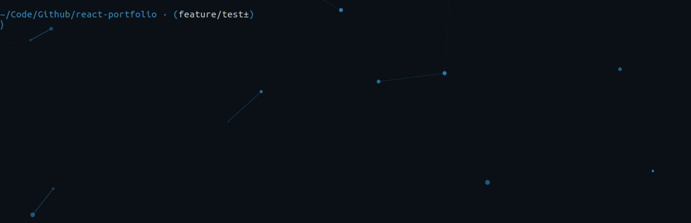

## react-portfolio
Developer portfolio application that uses React state, props, Hooks, and reusable UI components. Third party libraries are imported for lazy loading, animation effects and style. Jest framework used to test components. Click here for the decentralized version of the [app](https://mbrassey-portfolio.on.fleek.co/) deployed to the Interplanetary FileSystem (IPFS). 

#### Issues

- [x] [Initialize react app](https://github.com/MBrassey/react-portfolio/issues/1)
- [x] [Create components](https://github.com/MBrassey/react-portfolio/issues/2)
- [x] [Populate with my information & Stylize](https://github.com/MBrassey/react-portfolio/issues/3)
- [x] [Resume page](https://github.com/MBrassey/react-portfolio/issues/4)
- [x] [Deploy App & Create Readme](https://github.com/MBrassey/react-portfolio/issues/5)
- [x] [Unit Test](https://github.com/MBrassey/react-portfolio/issues/6)

#### Requirements

    node
    npm

#### Installation

    npm i

#### Usage

    npm run start
    npm run test a (optional)
    browse: localhost:3001/

<h6>
:cyclone: Click the image(s) below to view the live <a id="Screenshots" href="https://brassey.io/">webapplication</a>
</h6>

> Application Preview
> 

> Demo Video
> 

> Setup
> 

> Testing with Jest
> 

#### Questions

Contact me at [matt@brassey.io](mailto:matt@brassey.io) with any questions or comments.

#### License

`react-portfolio` is published under the **CC0_1.0_Universal** license.

> The Creative Commons CC0 Public Domain Dedication waives copyright interest in a work you've created and dedicates it to the world-wide public domain. Use CC0 to opt out of copyright entirely and ensure your work has the widest reach. As with the Unlicense and typical software licenses, CC0 disclaims warranties. CC0 is very similar to the Unlicense.
